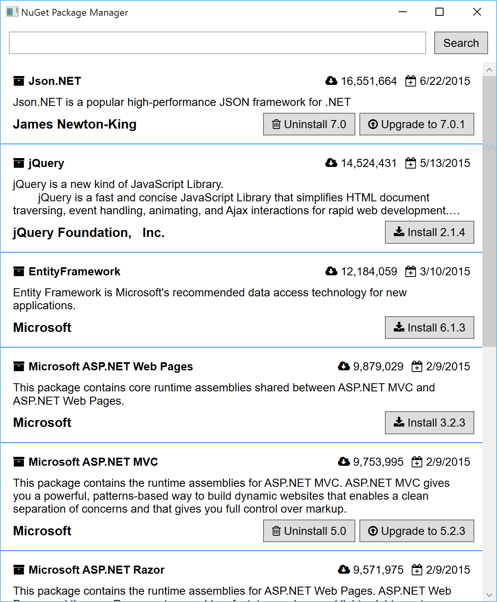
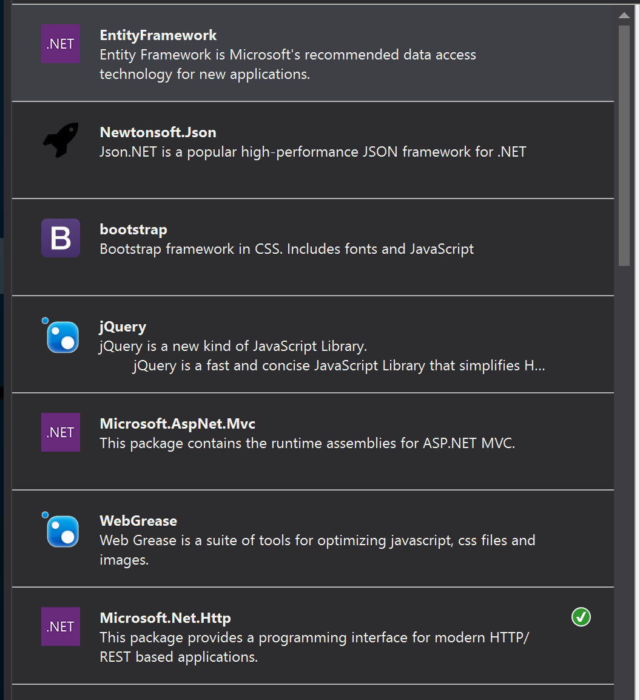

# PoC.NuGetWpf
Proof of concept for a better NuGet package manager experience. I kept the styling simple to coexist with Visual Studio themes.

__vs__

## Left to do

* Show uninstalled packages in a different way (with an install button)
* Make list selectable to act as the master in the master-detail
* Add package icon
* Create the detail pane
  * Install specific version
  * Install same version to other projects in solution
  * Show dependencies
